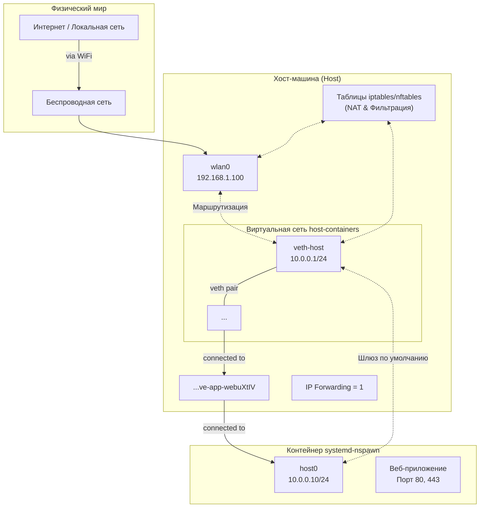

# Использование `systemd-nspawn` и маршрутизации вместо моста

## Основная идея

Поскольку нельзя использовать мост (`bridge`) напрямую с `wlan0` (это распространенное ограничение беспроводных интерфейсов), мы создадим изолированную виртуальную сеть между хостом и контейнером с помощью пары виртуальных Ethernet-интерфейсов (`veth`). Затем мы настроим на хосте преобразование сетевых адресов (NAT), чтобы трафик из локальной сети и интернета мог достигать контейнера через открытые порты.

---

### Схема/Диаграмма сетевой конфигурации



---

### Детальное описание структуры компонентов

#### 1. Виртуальная Ethernet-пара (veth pair)

Это основа связи "точка-точка".

* **`veth-host`**: Интерфейс на стороне **хоста**. Ему будет назначен статический IP-адрес, например, `10.0.0.1/24`.
* **`veth-peer`**: Второй интерфейс пары. Он будет "передан" внутрь контейнера при его запуске. Внутри контейнера он отображается как интерфейс `host0`.

**Назначение:** Создает прямую, изолированную сеть между хостом (`10.0.0.1`) и контейнером (`10.0.0.10`).

#### 2. Конфигурация сети контейнера (inside)

* **Интерфейс:** `host0` (это и есть `veth-peer`).
* **IP-адрес:** Статический адрес из той же подсети, что и хост, например, `10.0.0.10/24`.
* **Шлюз по умолчанию (Default Gateway):** Должен быть установлен на IP-адрес хоста в виртуальной сети, то есть на `10.0.0.1`. Это говорит контейнеру: "чтобы выйти куда-либо за пределы сети `10.0.0.0/24`, отправляй пакеты на хост".

#### 3. Конфигурация маршрутизации на хосте (Host Routing)

* **Таблица маршрутизации:** Хост автоматически узнает о сети контейнера, так как интерфейс `veth-host` находится в сети `10.0.0.0/24`. Любые пакеты для `10.0.0.10` будут отправлены через `veth-host`.
* **IP Forwarding:** На хосте необходимо активировать пересылку IP-пакетов между сетевыми интерфейсами. Это делается установкой системного параметра `net.ipv4.ip_forward=1`.

#### 4. Преобразование сетевых адресов (NAT) на хосте

Это ключевой компонент для доступа *извне*.

* **Source NAT (SNAT / Masquerading):** Позволяет контейнеру выходить в интернет. Когда контейнер (`10.0.0.10`) отправляет запрос во внешнюю сеть, хост "маскирует" этот запрос, подменяя исходный IP-адрес на свой собственный (`192.168.1.100`). Ответы из интернета приходят на хост, который перенаправляет их обратно в контейнер.
* **Destination NAT (DNAT / Port Forwarding):** Позволяет внешним клиентам из локальной сети подключаться к сервису в контейнере. Правило гласит: "Если на интерфейс `wlan0` пришел пакет на порт 80 (HTTP), перенаправь его по адресу `10.0.0.10:80`".

---

### Сводная таблица компонентов

| Компонент | Расположение | Пример IP/Примечания | Роль |
| :--- | :--- | :--- | :--- |
| **`wlan0`** | Хост | `192.168.1.100` | Основной интерфейс в локальную сеть/интернет. |
| **`veth-host`** | Хост | `10.0.0.1/24` | Конец виртуального канала, шлюз для контейнера. |
| **`veth-peer`** | *Передается в контейнер* | - | Второй конец пары. Становится `host0` внутри контейнера. |
| **`ve-app-...`** | Хост | Автоматически | Интерфейс, связывающий `veth-peer` с пространством имён контейнера. |
| **`host0`** | Контейнер | `10.0.0.10/24` | Основной сетевой интерфейс контейнера. |
| **Таблица NAT** | Хост (iptables/nftables) | - | Выполняет SNAT (Masquerade) и DNAT (Port Forwarding). |
| **IP Forwarding** | Ядро хоста | `net.ipv4.ip_forward=1` | Разрешает хосту быть маршрутизатором. |

Эта структура обеспечивает надежную и безопасную связь, изолируя контейнер в отдельной подсети и давая полный контроль над входящими и исходящими соединениями через хост.

## Используем существующие интерфейсы

Systemd уже создал veth пару: ve-app-webuXtIV на хосте и host0 в контейнере.

1. Настройка существующих интерфейсов
Проверяем текущее состояние:

```bash

# На хосте - смотрим интерфейсы

ip addr show ve-app-webuXtIV
ip link show ve-app-webuXtIV

# В контейнере - проверяем host0

sudo machinectl shell app-webui
ip addr show host0
exit
```

2. Настраиваем IP адреса на существующих интерфейсах

На хосте настраиваем ve-app-webuXtIV:

```bash
sudo ip link set ve-app-webuXtIV up
sudo ip addr add 10.0.0.1/24 dev ve-app-webuXtIV
```

В контейнере настраиваем `host0`:

```bash

# Входим в контейнер

sudo machinectl shell app-webui

# Настраиваем сеть

ip link set host0 up
ip addr add 10.0.0.2/24 dev host0
ip route add default via 10.0.0.1

# Настраиваем DNS

echo "nameserver 8.8.8.8" > /etc/resolv.conf
echo "nameserver 1.1.1.1" >> /etc/resolv.conf

# Проверяем

ip addr show host0
ping 10.0.0.1
exit
```

3. Настраиваем NAT и проброс портов

```bash
sudo nano /usr/local/bin/setup-existing-container-network.sh
```

```bash

# !/bin/bash

# Включаем IP форвардинг

echo 1 > /proc/sys/net/ipv4/ip_forward

# Очищаем старые правила

iptables -F
iptables -t nat -F

# Настраиваем интерфейс на хосте

ip link set ve-app-webuXtIV up
ip addr add 10.0.0.1/24 dev ve-app-webuXtIV 2>/dev/null || echo "IP already exists"

# NAT для выхода в интернет

iptables -t nat -A POSTROUTING -s 10.0.0.0/24 -o wlan0 -j MASQUERADE

# Разрешаем форвардинг

iptables -A FORWARD -i ve-app-webuXtIV -o wlan0 -j ACCEPT
iptables -A FORWARD -i wlan0 -o ve-app-webuXtIV -j ACCEPT

# Проброс порта 8080 из локальной сети к контейнеру

iptables -t nat -A PREROUTING -i wlan0 -p tcp --dport 8080 -j DNAT --to-destination 10.0.0.2:80
iptables -A FORWARD -p tcp -d 10.0.0.2 --dport 80 -j ACCEPT

# Проброс других портов при необходимости

# iptables -t nat -A PREROUTING -i wlan0 -p tcp --dport 8081 -j DNAT --to-destination 10.0.0.2:8081

echo "Network setup completed for existing interfaces"
echo "Host interface: ve-app-webuXtIV (10.0.0.1)"
echo "Container interface: host0 (10.0.0.2)"
```
