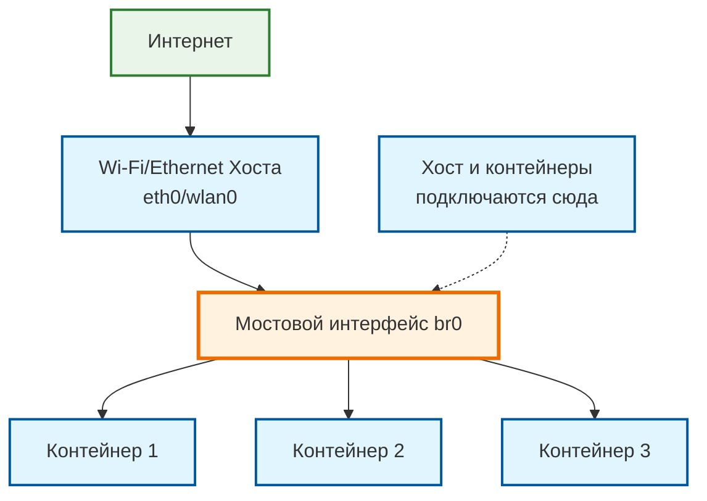

# Мостового интерфейс (bridge)

Настройка мостового интерфейса (bridge) — это правильный способ создать единую сеть для контейнеров, хоста и обеспечить им выход в интернет.

<div style="
    background: #fefce8;
    border: 1px solid #eab308;
    border-left: 5px solid #eab308;
    padding: 20px;
    margin: 20px 0;
    border-radius: 0 8px 8px 0;
    display: flex;
    align-items: flex-start;
    gap: 16px;
">
    <span style="
        font-size: 22px;
        color: #ca8a04;
        flex-shrink: 0;
        background: #fef9c3;
        padding: 8px;
        border-radius: 6px;
        font-weight: bold;
    ">🚧</span>
    <div>
        <strong style="
            color: #a16207;
            margin-bottom: 6px;
            display: block;
            font-size: 15px;
            font-family: monospace;
        ">Bridge со встроенной wlan0 на pi zero не работает. Необходимо искать другие варианты. Я пробую veth и routing iptables<br>Возникает ошибка:</strong>
        <p style="margin: 0; color: #854d0e; line-height: 1.6; font-size: 14px;">
            <code style="background: #fef9c3; padding: 2px 6px; border-radius: 3px; color: #854d0e;">The "Error: Device does not allow enslaving to a bridge" occurs because the Raspberry Pi's built-in Wi-Fi chip doesn't support the necessary 4-address mode (WDS) for true Layer 2 bridging. To work around this, you can use alternative methods such as Layer 3 routing with NAT and proxy ARP, purchase a USB Wi-Fi dongle that supports WDS, or switch to a setup where the Pi acts as an Access Point (AP)</code>
        </p>
    </div>
</div>

## Пошаговая инструкция, как это сделать на Raspberry Pi OS (Debian)

### Общая схема

```text
[ Интернет ]
      |
[ Wi-Fi/Ethernet Хоста (eth0/wlan0) ]
      |
[ Мостовой интерфейс (br0) ] <-- Хост и контейнеры подключаются сюда
      |      |      |
[ Контейнер 1 ]  [ Контейнер 2 ]  [ Контейнер 3 ]
```

### Диаграмма



### Шаг 1: Установка необходимых пакетов

Нам понадобится утилита для управления сетевыми мостами.

```bash
sudo apt update
sudo apt install -y bridge-utils
```

### Шаг 2: Настройка статического моста на хосте (Raspberry Pi)

Настройка моста br0 с помощью systemd-networkd

Настроим сеть с помощью systemd-networkd вместо dhcpcd. Это более современный и унифицированный подход.

#### Шаг 1: Проверьте, что управление сетью не занято другими демонами

Проверьте, какие сетевые демоны активны:

```bash
systemctl status dhcpcd systemd-networkd NetworkManager
```

Если dhcpcd или NetworkManager активны, их лучше отключить:

! Если работаете по SSH, то используйте скрипт ./network-migration.sh он с откатом при возникновении ошибок и проверен в работе

```bash
sudo systemctl stop dhcpcd
sudo systemctl disable dhcpcd
sudo systemctl stop NetworkManager
sudo systemctl disable NetworkManager
```

Включите и запустите systemd-networkd:

```bash
sudo systemctl enable systemd-networkd
sudo systemctl start systemd-networkd
```

#### Шаг 2: Создаем мостовой интерфейс br0

Создаем файл описания мостового устройства:

```bash
sudo nano /etc/systemd/network/br0.netdev
```

Добавьте содержимое:

```ini
[NetDev]
Name=br0
Kind=bridge
```

Создаем файл настройки моста:

```bash
sudo nano /etc/systemd/network/br0.network
```

Добавьте содержимое (настройте IP-адрес под свою сеть):

```ini
[Match]
Name=br0

[Network]
Address=10.10.10.1/24 #192.168.5.1/24

# Forwarding и NAT для выхода в интернет через хост
IPForward=yes
IPMasquerade=yes
```

#### Шаг 3: Настраиваем физический интерфейс (например, eth0)

Узнайте имя вашего физического интерфейса:

```bash
ip link show
```

Создайте конфигурацию для подключения интерфейса к мосту:

```bash
sudo nano /etc/systemd/network/eth0.network
# или
sudo nano /etc/systemd/network/wlan0.network
```

Добавьте содержимое (замените eth0 на ваше имя интерфейса):

```ini
[Match]
Name=eth0

[Network]
Bridge=br0
```

#### Шаг 4: Перезагружаем сетевые настройки

Перезапустите systemd-networkd:

```bash
sudo systemctl restart systemd-networkd
```

Проверьте создание моста:

```bash
networkctl status br0
```

или

```bash
ip addr show br0
```

Если нужно применить изменения немедленно:

```bash
sudo networkctl reload
sudo networkctl reconfigure br0
```

---

Устаревший вариант, через dhcpcd(у меня он даже не был запущен)
Мы создадим мост br0 и назначим ему статический IP-адрес. Это самый надежный способ.

Резервное копирование текущей конфигурации (опционально, но рекомендуется):

```bash
sudo cp /etc/dhcpcd.conf /etc/dhcpcd.conf.backup
```

Редактируем конфигурационный файл dhcpcd:

```bash
sudo nano /etc/dhcpcd.conf
```

Добавляем в конец файла настройки для моста.

<div class="note" style="background: #e3f2fd; border-left: 4px solid #2196f3; padding: 12px; margin: 16px 0; border-radius: 4px;">
    <strong>📝 NOTE:</strong> ЗАМЕНИТЕ 192.168.5.1/24 на нужный вам диапазон адресов, который не конфликтует с вашей основной сетью (например, если ваш роутер раздает 192.168.1.x, можно использовать 192.168.5.x).
</div>

```ini
# Отключаем получение IP для физического интерфейса (опционально, но рекомендуется для серверов)

denyinterfaces eth0 wlan0

# Создаем мостовой интерфейс br0 и назначаем ему статический IP

interface br0
static ip_address=192.168.5.1/24
static routers=192.168.1.1    # Укажите IP вашего роутера в основной сети
static domain_name_servers=192.168.1.1 8.8.8.8 # Укажите DNS вашего роутера и/или публичные DNS
```

Сохраните файл и выйдите из редактора (Ctrl+X, затем Y, затем Enter).

Настраиваем автоматическое создание моста при загрузке

Создаем файл конфигурации для systemd-networkd (даже если он не активен, этот метод работает):

```bash
sudo nano /etc/systemd/network/br0.netdev
```

Добавьте содержимое:

```ini
[NetDev]
Name=br0
Kind=bridge
```

Привяжем физический интерфейс (например, eth0) к мосту:

```bash
sudo nano /etc/systemd/network/br0-member-eth0.network
```

Добавьте содержимое:

```ini
[Match]
Name=eth0

[Network]
Bridge=br0
```

Перезагружаем сеть или весь хост:

```bash
sudo systemctl daemon-reload
sudo reboot
```

После перезагрузки проверьте мост:

```bash
ip addr show br0
# Должны увидеть что-то вроде
# 4: br0: <BROADCAST,MULTICAST,UP,LOWER_UP> mtu 1500 qdisc noqueue state UP group default qlen 1000
# link/ether aa:bb:cc:dd:ee:ff brd ff:ff:ff:ff:ff:ff
# inet 192.168.5.1/24 brd 192.168.5.255 scope global br0
# valid_lft forever preferred_lft forever
```

### Шаг 3: Настройка контейнеров для использования моста

Теперь нужно настроить `systemd-nspawn` для создания _виртуального Ethernet-интерфейса (veth)_ для каждого контейнера и подключения его к мосту br0.

<div class="animated-tip" style="
    background: #ecfdf5;
    border-left: 4px solid #10b981;
    padding: 18px;
    margin: 20px 0;
    border-radius: 0 12px 12px 0;
    display: flex;
    align-items: flex-start;
    gap: 14px;
    transition: all 0.3s ease;
    cursor: pointer;
" onmouseover="this.style.transform='translateX(4px)'; this.style.boxShadow='0 4px 12px rgba(16, 185, 129, 0.2)'"
onmouseout="this.style.transform='translateX(0)'; this.style.boxShadow='none'">
    <span style="
        font-size: 26px;
        color: #10b981;
        flex-shrink: 0;
        transition: transform 0.3s ease;
    " onmouseover="this.style.transform='scale(1.1)'"
    onmouseout="this.style.transform='scale(1)'">💡</span>
    <div>
        <strong style="
            color: #059669;
            margin-bottom: 6px;
            display: block;
            font-size: 14px;
        ">СОВЕТ</strong>
        <p style="margin: 0; color: #065f46; line-height: 1.5;">Самый правильный способ — использовать файлы конфигурации .nspawn.</p>
    </div>
</div>

Для КАЖДОГО контейнера создаем файл конфигурации.

<div style="
    background: #fff;
    border: 2px solid #e5e7eb;
    border-left: 4px solid #ef4444;
    padding: 16px;
    margin: 20px 0;
    border-radius: 0 6px 6px 0;
    display: flex;
    align-items: center;
    gap: 12px;
">
    <span style="
        font-size: 18px;
        color: #ef4444;
        flex-shrink: 0;
        font-weight: bold;
        background: #fef2f2;
        padding: 6px 10px;
        border-radius: 4px;
        border: 1px solid #fecaca;
    ">MUST</span>
    <div style="flex: 1;">
        <p style="margin: 0; color: #374151; line-height: 1.5; font-size: 14px;">
            <strong style="color: #ef4444;">Требование: </strong>
            Имя файла должно точно совпадать с именем директории контейнера в /var/lib/machines/.
        </p>
    </div>
</div>

Например, для контейнера `my-container-1`:

```bash
sudo nano /etc/systemd/nspawn/my-container-1.nspawn
```

Добавьте в файл следующую конфигурацию:

```ini
[Exec]
Boot=yes # Запускать systemd внутри контейнера

[Network]
Zone=br0 # Это ключевая строка - подключаем контейнер к зоне br0

# Alternative: Bridge=br0 (более старый, но тоже рабочий метод)
```

Повторите шаги 1-2 для `my-container-2` и `my-container-3`.

### Шаг 4: Включение IP-форвардинга и NAT (для выхода в интернет)

Чтобы трафик из контейнеров мог ходить в интернет через хост, нужно включить маршрутизацию и настроить MASQUERADE (NAT).

Включаем форвардинг пакетов:

```bash
sudo nano /etc/sysctl.conf
```

Найдите и раскомментируйте (уберите #) строку:

```bash
net.ipv4.ip_forward=1
```

Примените изменение без перезагрузки:

```bash
sudo sysctl -p
```

Настраиваем iptables для NAT:

```bash
sudo iptables -t nat -A POSTROUTING -o wlan0 -j MASQUERADE  # Используйте 'eth0' если Pi подключен по кабелю
sudo iptables -A FORWARD -i br0 -o wlan0 -j ACCEPT         # Разрешаем форвард с моста во внешнюю сеть
sudo iptables -A FORWARD -i wlan0 -o br0 -m state --state RELATED,ESTABLISHED -j ACCEPT # Разрешаем ответный трафик
```

Сохраняем правила iptables, чтобы они пережили перезагрузку:

```bash
sudo apt install iptables-persistent
```

Во время установки вам предложат сохранить текущие правила для IPv4 и IPv6. Ответьте «Да».
Или сохраните вручную после настройки:

```bash
sudo netfilter-persistent save
```

### Шаг 5: Запуск контейнеров и настройка сети внутри них

Запустите контейнеры:

```bash
sudo machinectl start my-container-1
sudo machinectl start my-container-2
sudo machinectl start my-container-3
```

Войдите в контейнер и настройте получение IP-адреса по DHCP (используя systemd-networkd внутри контейнера):

```bash
sudo machinectl login my-container-1
```

Внутри контейнера:

```bash
# Убедитесь, что systemd-networkd активен
systemctl status systemd-networkd

# Создайте файл для настройки сети
cat > /etc/systemd/network/80-dhcp.network << EOF
[Match]
Name=host0 # Или другой интерфейс (проверьте через 'ip link')

[Network]
DHCP=ipv4
EOF

# Перезапустите networkd
systemctl restart systemd-networkd

# Проверьте, получил ли контейнер IP-адрес
ip addr show
# Должен быть выдан адрес из диапазона 192.168.5.x от хоста (который является DHCP-сервером)

ping 8.8.8.8     # Проверьте выход в интернет
ping 192.168.5.1 # Проверьте связь с хостом
ping 192.168.5.2 # Проверьте связь с другим контейнером
```

## Итог

После этих шагов у вас будет:

* Мост br0 с IP 192.168.5.1.

* 3 контейнера с IP-адресами вида 192.168.5.x, выданными хостом.

* Связь между всеми контейнерами и хостом.

* Выход в интернет для всех контейнеров через NAT на хосте.

* Доступ к контейнерам с хоста по их IP-адресам.

* Для доступа к сервисам в контейнерах из вашей основной домашней сети вам нужно будет добавить правила проброса портов (port forwarding) с хоста на конкретные контейнеры в настройках iptables.

```mermaid
flowchart TD
    %% Основная схема сети
    subgraph HOST[ХОСТ (HOST)]
        direction TB
        eth0[Ethernet eth0<br/>192.168.1.100]
        br[Bridge br-containers<br/>10.10.10.1/24]
        lo[Loopback lo<br/>127.0.0.1]
        
        eth0 --> br
    end

    BRIDGE[СЕТЕВОЙ МОСТ<br/>br-containers<br/>MAC: bridge-mac]

    HOST --> BRIDGE

    subgraph CONTAINERS[Контейнеры]
        direction LR
        C1[КОНТЕЙНЕР 1<br/>app-webui<br/>host0: 10.10.10.2/24<br/>GW: 10.10.10.1<br/>MAC: veth-mac1]
        C2[КОНТЕЙНЕР 2<br/>backend<br/>host0: 10.10.10.3/24<br/>GW: 10.10.10.1<br/>MAC: veth-mac2]
    end

    BRIDGE --> C1
    BRIDGE --> C2

    LAN[ДРУГИЕ УСТРОЙСТВА<br/>в сети LAN]

    BRIDGE --> LAN
```

```mermaid
flowchart TD
    %% Детальная схема интерфейсов
    subgraph HOST_DETAIL[HOST (192.168.1.100)]
        direction TB
        ETH0[eth0<br/>MAC: AA:BB<br/>192.168.1.100]
        BR0[br0<br/>MAC: CC:DD<br/>10.10.10.1]
        LO[lo<br/>127.0.0.1]
        
        ETH0 --> FWD[FORWARDING<br/>iptables]
        BR0 --> FWD
    end

    FWD --> NETWORK[Сетевое взаимодействие]

    subgraph CONTAINERS_DETAIL[Контейнеры]
        direction LR
        CONT1[CONTAINER 1<br/>app-webui]
        CONT1_INT[host0<br/>10.10.10.2<br/>MAC: EE:FF]
        CONT1 --> CONT1_INT

        CONT2[CONTAINER 2<br/>backend] 
        CONT2_INT[host0<br/>10.10.10.3<br/>MAC: GG:HH]
        CONT2 --> CONT2_INT
    end

    NETWORK --> CONT1_INT
    NETWORK --> CONT2_INT

    LAN_NETWORK[LAN<br/>192.168.1.0/24]
    NETWORK --> LAN_NETWORK

    %% Связи между компонентами
    linkStyle 0,1,2,3,4,5,6,7 stroke:#666,stroke-width:2px
```

## Таблица IP адресов

| Устройство     | Интерфейс | IP адрес      | Шлюз        | MAC адрес    |
|----------------|-----------|---------------|-------------|-------------|
| **Хост**       | eth0      | 192.168.1.100 | 192.168.1.1 | AA:BB:CC:DD:EE:FF |
| **Хост**       | br0       | 10.10.10.1/24 | -           | 11:22:33:44:55:66 |
| **Контейнер 1**| host0     | 10.10.10.2/24 | 10.10.10.1  | EE:FF:00:11:22:33 |
| **Контейнер 2**| host0     | 10.10.10.3/24 | 10.10.10.1  | GG:HH:44:55:66:77 |

## Маршрутизация

```
Контейнер 1 (10.10.10.2) → BRIDGE (10.10.10.1) → HOST eth0 (192.168.1.100) → INTERNET
Контейнер 2 (10.10.10.3) → BRIDGE (10.10.10.1) → HOST eth0 (192.168.1.100) → INTERNET  
Контейнер 1 ↔ Контейнер 2 через BRIDGE (10.10.10.1)
```
